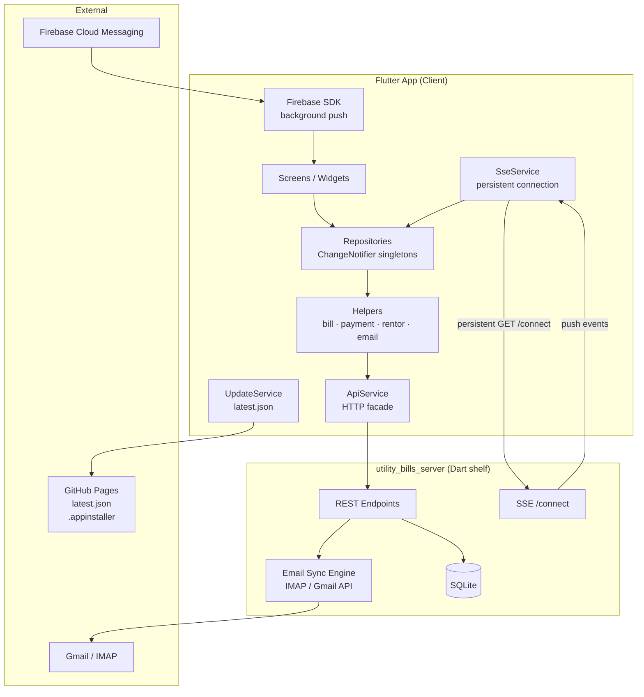
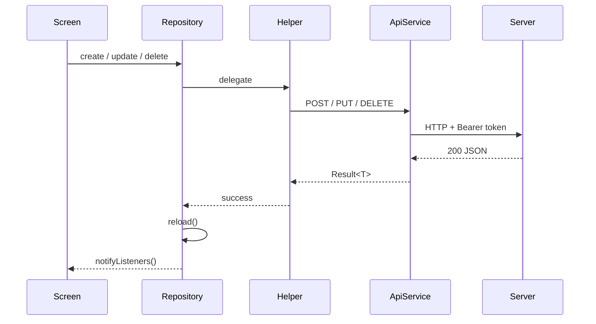
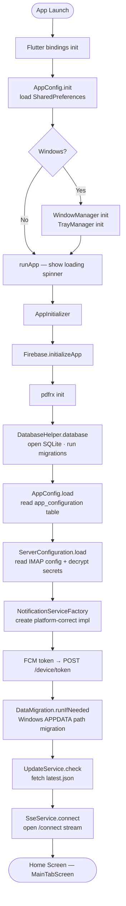
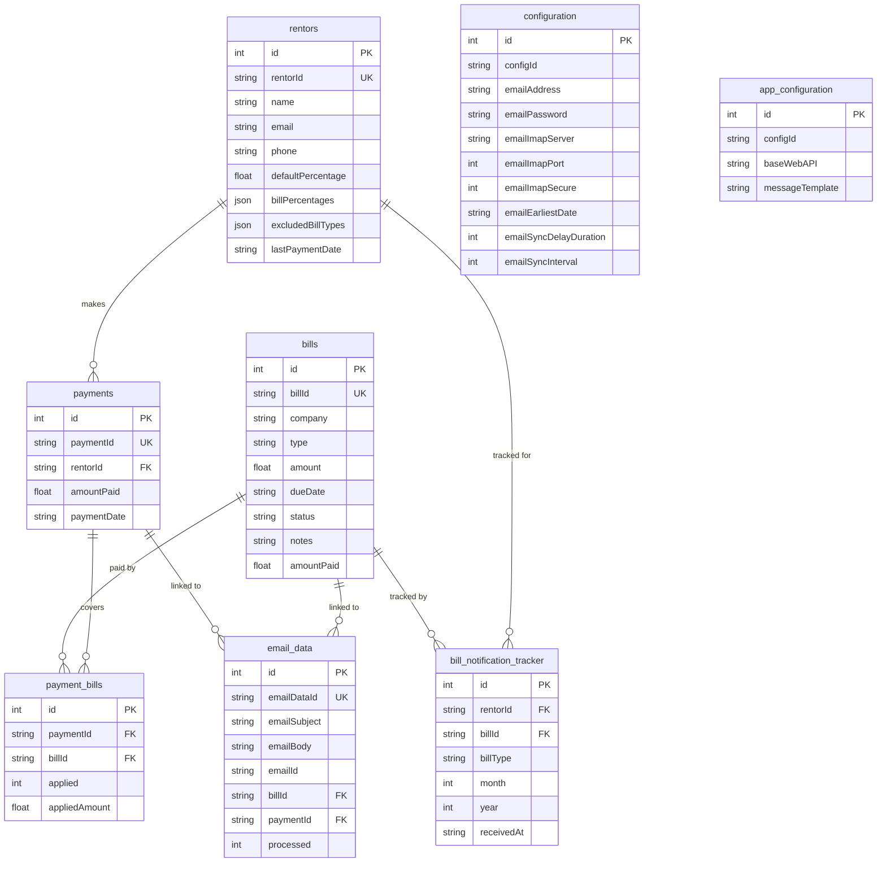
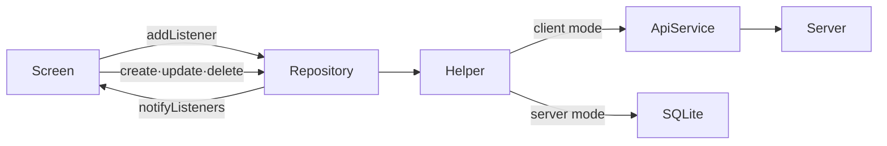
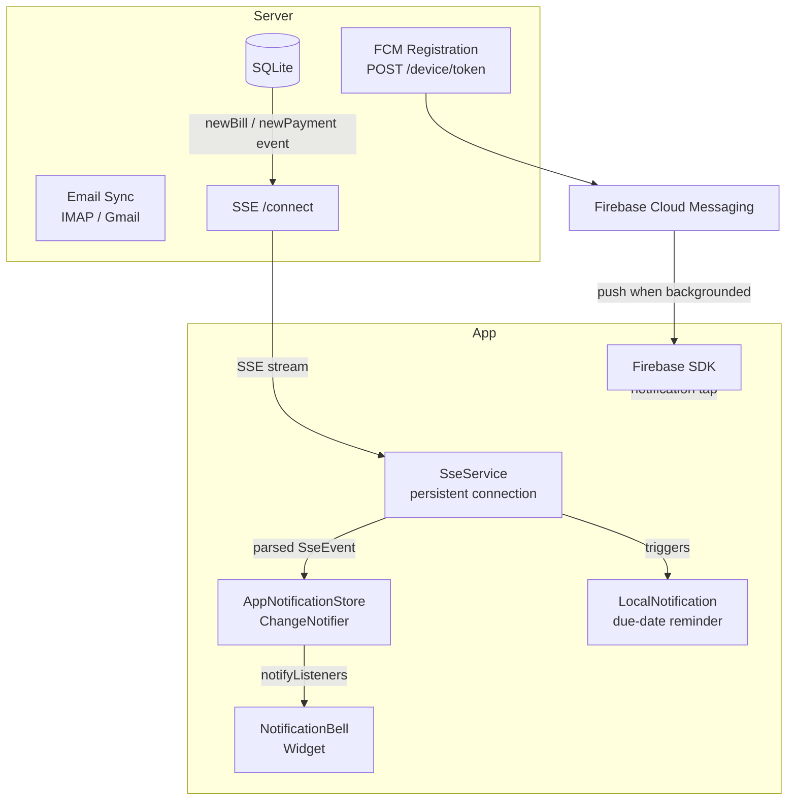
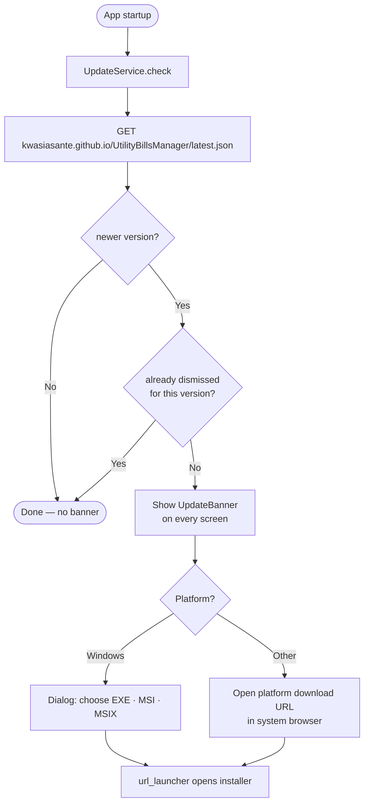
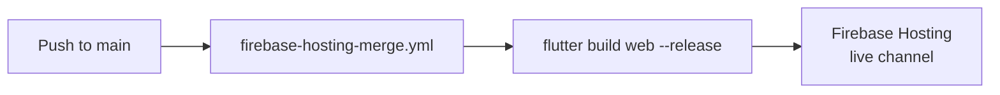
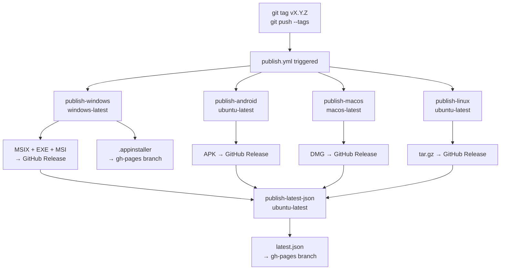

# Utility Bills Manager

A cross-platform Flutter application for tracking utility bills, managing rentor payments, and syncing bill data from Gmail — with CSV and PDF export, real-time push notifications, and an in-app auto-update checker.

Runs on **Android, iOS, macOS, Windows, Linux, and Web**.

---

## Table of Contents

- [Features](#features)
- [System Architecture](#system-architecture)
- [App Startup Flow](#app-startup-flow)
- [Code Structure](#code-structure)
- [Data Layer](#data-layer)
- [Notification & Real-Time Flow](#notification--real-time-flow)
- [Update Checker](#update-checker)
- [Getting Started](#getting-started)
- [Deployment & Release](#deployment--release)
- [Key Dependencies](#key-dependencies)

---

## Features

- **Bill Management** — Create, edit, and delete utility bills (electric, gas, water, internet, credit card). Track due dates, amounts, and payment status (paid / partial / unpaid).
- **Payment Tracking** — Log payments, assign them to specific bills and rentors. Deleting a payment automatically reverses applied amounts.
- **Rentor Management** — Manage rentors, assign percentage splits per bill type, exclude bill types, and track what each rentor owes. The **Calculate Amount Owed** button shows a per-bill-type breakdown accounting for percentages, exclusions, and prior payments.
- **Email Sync (Gmail / IMAP)** — Sign in with Google (web) or connect via IMAP (native) to pull bill-related emails. Parsed emails are matched to bills and payments automatically. Sync can be triggered on-demand or run on a schedule.
- **Summary Screen** — Monthly overview grouped by bill type with "considered paid" threshold logic. A **Rentors Owed** card at the top shows what each rentor owes for the current month.
- **Bill Summary Messages** — Select bills, preview a generated message (using a configurable template), and share directly to WhatsApp or any messaging app.
- **Export** — Export summaries as CSV or PDF, including per-bill rentor contributions.
- **Real-Time Notifications** — Server-Sent Events (SSE) push `newBill` / `newPayment` events instantly. Firebase Cloud Messaging (FCM) handles push when the app is backgrounded. In-app notification bell with unread badge and slide-in panel.
- **In-App Update Checker** — Polls `latest.json` from GitHub Pages on startup. When a newer version is found, a `MaterialBanner` appears on every screen. On Windows a dialog offers all three installer formats (EXE, MSI, MSIX).
- **Settings** — API base URL with live reachability check; IMAP credentials and sync schedule configurable from within the app.
- **Windows Extras** — System tray icon, window lifecycle management, InnoSetup EXE and WiX MSI installers, MSIX auto-update via `.appinstaller`.

---

## System Architecture

The app always runs in **client mode**, talking to a companion Dart shelf server (`utility_bills_server`) over HTTP. The server manages the SQLite database, email sync, and FCM token registration.



### Request / Response Flow



---

## App Startup Flow



---

## Code Structure

```
lib/
├── config/
│   ├── app_config.dart           # Mode, API URL, device ID, message template
│   └── server_configuration.dart # IMAP config + AES-256-GCM secret decryption
│
├── data/
│   ├── models/                   # Bill, Payment, Rentor, EmailData,
│   │   └── ...                   # AppConfiguration, ServerConfig, AuthSession,
│   │                             # AppState, AppNotification, SseEvent, Result<T>
│   └── repositories/             # ChangeNotifier singletons (one per domain)
│       ├── bills_repository.dart
│       ├── payments_repository.dart
│       ├── rentors_repository.dart
│       ├── email_data_repository.dart
│       └── server_config_repository.dart
│
├── database/                     # SQLite factory — platform-conditional exports
│   ├── db_factory.dart           # Public export (selects correct impl at compile time)
│   ├── db_factory_native.dart    # sqflite_common_ffi (Windows / Linux / macOS)
│   ├── db_factory_web.dart       # sqflite_common_ffi_web
│   └── db_factory_stub.dart
│
├── factory/
│   ├── notification/             # createNotificationService() — platform factory
│   └── windows/                  # WindowManager + TrayManager factories
│
├── helpers/                      # Business logic — bridge between Repository and storage
│   ├── database/database_helper.dart   # Low-level CRUD; schema v18; migrations
│   ├── bills/bills_helper.dart
│   ├── payments/payments_helper.dart
│   ├── rentors/rentors_helper.dart
│   ├── email/email_data_helper.dart
│   ├── configuration/
│   │   ├── app_config_helper.dart
│   │   └── server_config_helper.dart
│   └── bill_readiness/bill_notification_tracker_helper.dart
│
├── screens/
│   ├── auth/                     # login_screen · register_screen
│   ├── base/                     # GoogleSignInScreenState mixin
│   ├── bills/                    # bill_list_screen · add_edit_bill_screen
│   ├── rentors/                  # rentor_list_screen · add_edit_rentor_screen
│   ├── payments/                 # payment_list_screen · add_edit_payment_screen
│   ├── emails/                   # email_list_screen · edit_email_data_screen
│   ├── summary/                  # summary_screen
│   ├── bill_summary/             # bill_selection_screen · message_preview_screen
│   ├── settings/                 # settings_screen · app_config_screen · server_config_screen
│   └── main_tab_screen.dart      # Root navigation shell (IndexedStack)
│
├── services/
│   ├── api/api_service.dart      # HTTP facade + 8 domain service classes
│   ├── auth/auth_service.dart    # Bearer token, login/logout, SharedPreferences
│   ├── email/                    # IMAP (native) · Gmail API (web) · stub
│   ├── google/                   # Google sign-in — native · web · stub
│   ├── notification/             # Abstract interface + native/web/windows impls
│   │   ├── sse_service*.dart     # SSE — dart:io (native) · EventSource (web)
│   │   └── app_notification_store.dart   # In-app bell + slide-in panel
│   ├── update/                   # UpdateService · UpdateInfo (semver comparison)
│   ├── bill_readiness/           # Due-date reminder logic
│   ├── bill_summary/             # Rentor message generation (pure functions)
│   ├── windows/                  # WindowManagerService · TrayManagerService
│   └── logs/                     # ServerLogOutput · LogUploadService
│
├── utils/
│   ├── app_logger.dart           # Structured logging (local + optional server upload)
│   ├── export_utils.dart         # CSV / PDF export
│   ├── preferences.dart          # SharedPreferences wrapper
│   ├── bills/bills_parser.dart
│   ├── email/email_parser.dart
│   ├── payments/payments_parser.dart
│   ├── files/                    # file_utils · native_pdf_text_extractor
│   ├── windows/                  # DataMigration · AppWindowsListener
│   └── dialogs/                  # SyncOptionsDialog · DueDateFilterSheet
│
├── widgets/
│   ├── notification_bell_icon.dart
│   ├── notification_panel.dart
│   ├── update_banner.dart
│   └── responsive_constraint.dart
│
├── main.dart                     # Entry point + AppInitializer
└── firebase_options.dart
```

### Platform Conditional Exports

Platform-specific code is isolated via Dart's `if (dart.library.*)` conditional exports. The same public interface compiles correctly on all six platforms:

| Interface | Native impl | Web impl | Stub |
|---|---|---|---|
| `db_factory` | `sqflite_common_ffi` | `sqflite_common_ffi_web` | — |
| `EmailService` | `enough_mail` IMAP | Gmail REST API | no-op |
| `GoogleAccountService` | `google_sign_in` native | `google_sign_in_web` | no-op |
| `NotificationService` | `flutter_local_notifications` | Firebase web | Windows-specific |
| `SseService` | `dart:io` HttpClient | `EventSource` API | — |

---

## Data Layer

### Database Schema (v18)



### Repository Pattern

All repositories are `ChangeNotifier` singletons. Screens subscribe via `addListener()` and re-render when data changes. Write operations (create / update / delete) automatically call `reload()` on success.



---

## Notification & Real-Time Flow



SSE events that can arrive from the server:

| Event | Effect |
|---|---|
| `newBill` | Reloads BillsRepository, shows notification |
| `newPayment` | Reloads PaymentsRepository, shows notification |
| `newEmail` | Reloads EmailDataRepository |
| `billUpdated` / `paymentUpdated` / `emailUpdated` | Targeted repository reload |

---

## Update Checker



`latest.json` lives in the `gh-pages` branch and is updated automatically by CI on every release:

```json
{
  "version": "1.2.3",
  "build": 42,
  "tag": "v1.2.3",
  "downloads": {
    "windows_msix": "https://github.com/.../utility_bills_manager_1.2.3.42.msix",
    "windows_exe":  "https://github.com/.../utility_bills_manager-1.2.3-setup.exe",
    "windows_msi":  "https://github.com/.../utility_bills_manager-1.2.3-setup.msi",
    "android":      "https://github.com/.../utility_bills_manager-1.2.3-android.apk",
    "macos":        "https://github.com/.../utility_bills_manager-1.2.3-macos.dmg",
    "linux":        "https://github.com/.../utility_bills_manager-1.2.3-linux-x64.tar.gz"
  }
}
```

---

## Getting Started

### Prerequisites

- Flutter SDK `^3.7.0` / Dart `^3.7.0`
- A running instance of `utility_bills_server`

### Configuration

The app reads config from three sources in priority order:

1. `assets/config/local_secrets.json` (highest — never committed)
2. `--dart-define` flags
3. Hard-coded defaults

#### Secrets file

Create `assets/config/local_secrets.json`:

```json
{
  "EMAIL_ADDRESS":     "you@example.com",
  "EMAIL_PASSWORD":    "your-app-password",
  "EMAIL_IMAP_SERVER": "imap.gmail.com",
  "EMAIL_IMAP_PORT":   993,
  "EMAIL_IMAP_SECURE": true
}
```

#### Encrypting secrets (optional but recommended)

```sh
dart run scripts/encrypt_secrets.dart --key=<your-32-char-key>
```

String values become `enc:…` tokens; int/bool fields are left as-is. Pass the key at every build:

```sh
--dart-define=SECRETS_KEY=<your-32-char-key>
```

#### Platform build commands

```sh
# Android debug
flutter run --dart-define=SECRETS_KEY=<key>

# Android release APK
flutter build apk --dart-define=SECRETS_KEY=<key>

# Web
flutter build web --dart-define=SECRETS_KEY=<key>

# Windows
flutter build windows \
  --dart-define=BUILD_TARGET=windows \
  --dart-define=SECRETS_KEY=<key>
```

> `--dart-define=BUILD_TARGET=windows` is required on Windows to select the correct notification service (`notification_service_windows.dart`).

#### Android release signing

Create `android/key.properties` (gitignored):

```properties
storePassword=<keystore-password>
keyPassword=<key-password>
keyAlias=upload
storeFile=../upload-keystore.jks
```

Generate a new keystore if needed:

```sh
keytool -genkey -v \
  -keystore android/upload-keystore.jks \
  -keyalg RSA -keysize 2048 -validity 10000 \
  -alias upload
```

#### Firebase setup

| Platform | Required file |
|---|---|
| Android | `android/app/google-services.json` |
| iOS | `ios/Runner/GoogleService-Info.plist` |
| macOS | `macos/Runner/GoogleService-Info.plist` |
| Linux | Firebase skipped at startup; SSE still works |

#### VS Code

`.vscode/launch.json` has pre-configured run targets for Chrome and Windows. Update `SECRETS_KEY` in both targets after regenerating a key.

### Running

```sh
flutter pub get
flutter run --dart-define=SECRETS_KEY=<key>
```

---

## Deployment & Release

### Web — Firebase Hosting (automatic)

Triggered on every push to `main`. No manual steps required.



### Desktop & Mobile — GitHub Actions (tag-triggered)



**What the Windows job does:**

1. Checks out `main` + the `gh-pages` branch side by side
2. Runs `publish.ps1` — builds Flutter Windows, packages as MSIX, rewrites `.appinstaller` URIs
3. Uploads MSIX to the GitHub Release; rewrites `.appinstaller` to point to the release download URL
4. Builds an EXE installer (InnoSetup) and uploads to GitHub Release
5. Builds an MSI installer (WiX v4) and uploads to GitHub Release
6. Commits the updated `.appinstaller` to the `gh-pages` branch

**Windows installers:**

| File | Tool | Format | Notes |
|---|---|---|---|
| `windows/installer/setup.iss` | [InnoSetup](https://jrsoftware.org/isinfo.php) | EXE | Recommended for most users |
| `windows/installer/product.wxs` | [WiX Toolset v4](https://wixtoolset.org/) | MSI | Enterprise / IT deployment |

Both installers detect an existing installation and offer in-place upgrade, auto-close a running instance, and preserve user data at `%APPDATA%\AsanteDevs\Utility Bills Manager\`.

### Local Windows release

```sh
.\publish.ps1
# Auto-sets up the gh-pages worktree if it doesn't exist, then:

git -C gh-pages add .
git -C gh-pages commit -m "chore: release vX.Y.Z"
git -C gh-pages push origin gh-pages
```

### Branches

| Branch | Purpose |
|---|---|
| `main` | Source code + CI workflows |
| `gh-pages` | GitHub Pages — `latest.json`, `.appinstaller`, install page |

### Triggering a release

```sh
# 1. Bump version in pubspec.yaml (version: X.Y.Z+BUILD)
# 2. Commit and push to main
# 3. Tag and push — this triggers publish.yml
git tag vX.Y.Z
git push --tags
```

---

## Key Dependencies

| Package | Purpose |
|---|---|
| `sqflite` / `sqflite_common_ffi` / `sqflite_common_ffi_web` | Cross-platform SQLite |
| `google_sign_in` / `googleapis` | Gmail OAuth & API access |
| `enough_mail` | IMAP email fetching (native) |
| `firebase_core` / `firebase_auth` / `firebase_messaging` | Firebase init, auth, FCM push |
| `flutter_local_notifications` | Due-date reminders |
| `pdf` / `pdfrx` | PDF generation and parsing |
| `share_plus` | File sharing / export |
| `cryptography` | AES-256-GCM encryption for `local_secrets.json` |
| `logger` | Structured logging via `AppLogger` |
| `package_info_plus` | Reads running version for update checker |
| `url_launcher` | Opens download URLs from `UpdateBanner` |
| `device_info_plus` / `android_id` | Platform-native device IDs |
| `tray_manager` / `window_manager` | Windows system tray and window lifecycle |
| `msix` | MSIX installer packaging |
| `intl` | Date / number formatting |
| `uuid` | UUID generation |
| `shared_preferences` | Lightweight key-value persistence |
| `sse` / `sse_channel` | Server-Sent Events (real-time push) |

---

## License

Private — not published to pub.dev.
